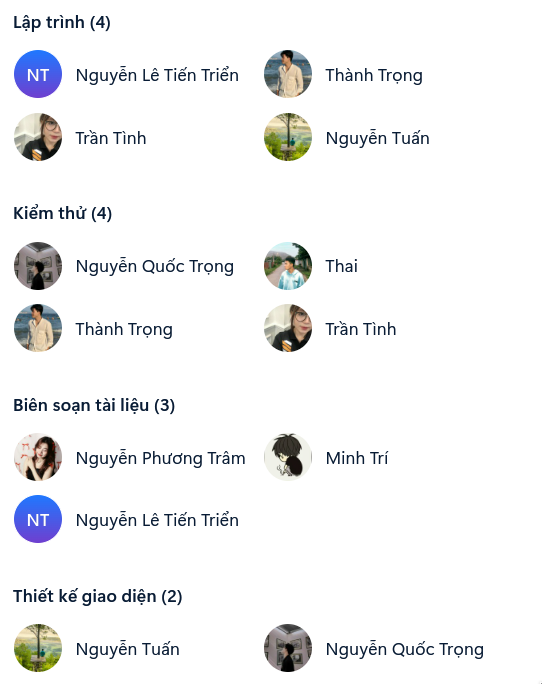
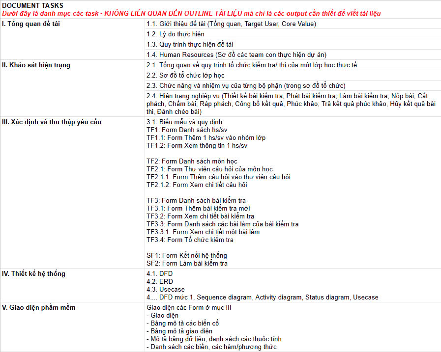

# Project Member and tasks

# Now

## 1\. The begin

### 1.1 check for starting

- Bản thiết kế database sơ bộ đã có, **Team Test** thực hiện kiểm tra bản thiết kế này dựa trên kỹ năng và kiến thức đã học

    - > Test cho kỹ dùm đi chứ database sai thì code thấy gớm lắm. Cầu xin mọi người áp dụng những gì đã học, không có cái nào thừa đâu huhu.

- Dựa trên kết quả sau khi kiểm tra -> Viết SQL script mô phỏng một hệ thống đang sử dụng (database mẫu) để dev báo xong chức năng nào thì kiểm tra chức năng đó và cũng thuận tiện cho dev test lúc code.

> - **Thực hiện:** Quốc Trọng (logic nghiệp vụ), Thái (phân tích dữ liệu), anh Tuấn (cố vấn), Thành Trọng (SQL script)
> - **Thời hạn:** đến hết ngày 21/9 (thứ 7)
> - **Sản phẩm:** Complete database design, database generation SQL script.

### 1.2 Project Overview Document

> ### Team Doc bắt đầu viết các Chương 1 và 2

## 2\. Start building

### 2.1 GUI Design Team:

Thiết kết giao diện theo thứ tự các form dưới đây:

- Server app:
    - Danh sách học sinh/sinh viên
        - Thêm 1 hs/sv vào nhóm lớp
        - Xem thông tin 1 hs/sv
    - Danh sách môn học
        - Ngân hàng câu hỏi của môn học
            - Thêm câu hỏi vào ngân hàng câu hỏi
            - Xem chi tiết câu hỏi
    - Danh sách bài kiểm tra
        - Thêm bài kiểm tra mới
        - Xem chi tiết bài kiểm tra
        - Danh sách các bài làm của bài kiểm tra
            - Chi tiết một bài làm
        - Tổ chức bài kiểm tra
- Client app:
    - Kết nối hệ thống
    - Làm bài kiểm tra
        - Nộp bài thành công/thất bại

> - **Thực hiện:** anh Tuấn, Quốc Trọng
> - **Công cụ:** JavaFX Scene Builder
> - **Yêu cầu kỹ thuật:** thiết kế tối ưu, bắt buộc modular các form (bao gồm cả css), tối thiểu elements với tối đa công dụng, định nghĩa hiệu quả các elements (id, class)
> - **Yêu cầu nghiệp vụ:** bố cục hợp lí, hiệu quả, thân thiện người dùng, tối ưu tương tác với người dùng để giảm thiểu sai sót phần mềm
> - **Quá trình:** hợp tác khắt khe với **Team GUI Controller** để báo cáo yêu cầu cho team xử lý giao diện cũng như xác minh khả năng thực hiện được hay không của team xử lý giao diện

### 2.2 Dev Team:

- #### Nhiệm vụ: Cần xây dựng những lớp sau:

    - GUI controller
    - BUS
    - DAL
    - DTO
> - #### Thực hiện:
>
>     - **DTO:** Thái, Triển
>     - **DAL:** Thái, Triển
>     - **BUS:** Triển
>     - **GUI controller:** Thành Trọng, Tình
> - #### Quá trình:
>
>     - **Thành Trọng-Tình** liên hệ với **Team GUI** để viết các *Controller* tương ứng với tiến trình hiện tại (các form đã hoàn thành).
>     - Dựa vào bảng thiết kế database, **Thái** viết tập hợp Class DTO thô để chứa dữ liệu từ DAL đổ vào. Sau đó bắt đầu viết các Class DAL. Để phối hợp với team GUI và BUS **Thái-Triển** hãy viết Class theo thứ tự của bảng phân công GUI ở trên. Viết những Class lớn trước rồi đến những Class liên quan.
>     - **Triển** sẽ dựa theo tiến độ của **Thái** và **Thành Trọng-Tình** để xây dựng các Class chức năng nghiệp vụ (mong mọi người báo cáo thường xuyên).

### 2.3 Doc Team

> - **Thực hiện:** anh Tuấn (cố vấn), Triển (diễn giải), Trí (công thức), Trâm (định dạng)
> - **Quá trình:** Liên tục tìm tài nguyên để hoàn thiện tài liệu, liên hệ với tất cả các team khác để có thông tin mong muốn
> - **Yêu cầu:** bám sát dự án, chính xác và đúng định dạng, cấu trúc của một bản báo cáo phần mềm (Viết có tâm nhé mọi người)

## Testing
> - **Thực hiện:** Quốc Trọng, Thành Trọng, Thái, Tình
> - **Yêu cầu:** liên tục tìm hiểu về quy trình xây dựng phần mềm, nắm rõ kỹ thuật và công nghệ sử dụng, hỗ trợ **Team Dev** đưa ra hướng giải quyết tối ưu và chất lượng.
> - **Sản phẩm:** lỗi, bug, sai logic =))
